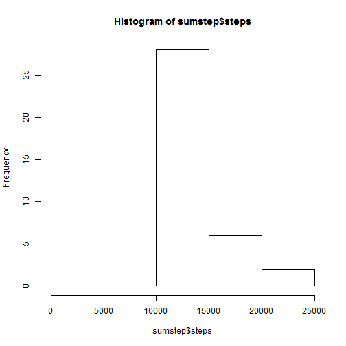
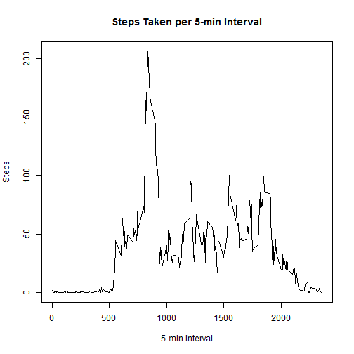
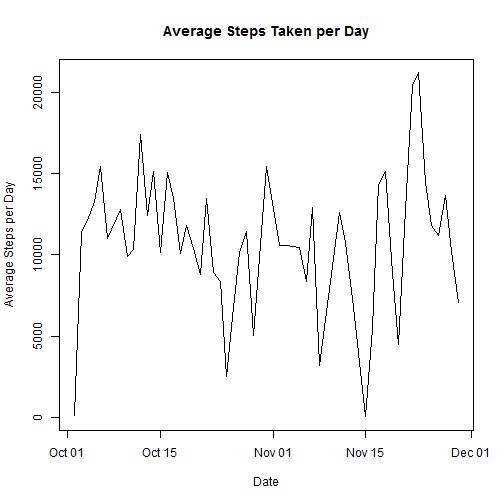
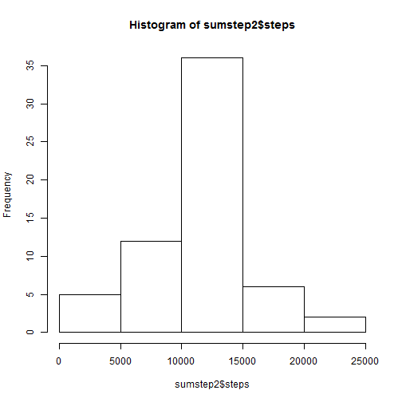
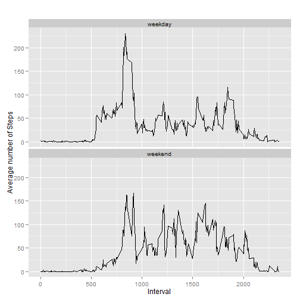

##Reproducible Research - Peer Assessment 1

###Introduction
It is now possible to collect a large amount of data about personal movement using activity monitoring devices such as a Fitbit, Nike Fuelband, or Jawbone Up. These type of devices are part of the "quantified self" movement - a group of enthusiasts who take measurements about themselves regularly to improve their health, to find patterns in their behavior, or because they are tech geeks. But these data remain under-utilized both because the raw data are hard to obtain and there is a lack of statistical methods and software for processing and interpreting the data.

This assignment makes use of data from a personal activity monitoring device. This device collects data at 5 minute intervals throughout the day. The data consists of two months of data from an anonymous individual collected during the months of October and November, 2012 and include the number of steps taken in 5 minute intervals each day.

###Data
The data for this assignment can be downloaded from the course web site:
.        Dataset: Activity monitoring data [52K]
The variables included in this dataset are:
.	steps: Number of steps taking in a 5-minute interval (missing values are coded as NA)
.	date: The date on which the measurement was taken in YYYY-MM-DD format
.	interval: Identifier for the 5-minute interval in which measurement was taken
The dataset is stored in a comma-separated-value (CSV) file and there are a total of 17,568 observations in this dataset.

##Loading data and 

```r
##Load file
dat <- read.csv("./activity.csv")

##Convert column date to date and steps to numeric
dat$date <- as.Date(dat$date)
dat$steps <- as.numeric(dat$steps)
```

###What is mean total number of steps taken per day?

```r
##Sum steps for each day
sumstep <- aggregate(steps ~ date, dat, sum, na.action = na.omit)

##Plot Histogram
hist(sumstep$steps)
```

 

```r
##Calucate mean and median steps per day
meanstep <- mean(sumstep$steps)
medianstep <- median(sumstep$steps)
print(meanstep)
```

```
## [1] 10766.19
```

```r
print(medianstep)
```

```
## [1] 10765
```
The mean total number of steps taken per day is `meanstep`.

The median total number of steps taken per day is `medianstep`.

###What is the average daily activity pattern?

```r
##Make Time-Series plot of 5-min intervals & daily average
intmean <- aggregate(steps ~ interval, dat, mean, na.action = na.omit)
plot(x=intmean$interval, y=intmean$steps, type="l", ylab="Steps", 
     xlab="5-min Interval", main="Steps Taken per 5-min Interval")
```

 

```r
plot(sumstep, type="l", ylab="Average Steps per Day", 
     xlab="Date", main="Average Steps Taken per Day")
```

 

```r
##Calculate 5-min interval with highest steps total
maxstepint <- max(intmean$steps)
intmean[intmean$steps == maxstepint,]
```

```
##     interval    steps
## 104      835 206.1698
```

###Imputing missing values

```r
##Calculate the number of NA's in the data
sum(nrow(dat[dat$steps == "NA",]))
```

```
## [1] 2304
```

```r
##Replace NA's with the mean of each interval
dat2 <- dat
for(i in 1:nrow(dat2)){
        if (is.na(dat2$steps[i])) {
                intvalue <- dat2$interval[i]
                rowid <- which(intmean$interval == intvalue)
                stepvalue <- intmean$steps[rowid]
                dat2$steps[i] <- stepvalue
        }
}

##Sum steps for each day of modified data
sumstep2 <- aggregate(steps ~ date, dat2, sum, na.action = na.omit)

##Plot Histogram of modified data
hist(sumstep2$steps)
```

 

```r
##Calucate mean and median steps per day
meanstep2 <- mean(sumstep2$steps)
medianstep2 <- median(sumstep2$steps)
print(meanstep2)
```

```
## [1] 10766.19
```

```r
print(medianstep2)
```

```
## [1] 10766.19
```

The mean is the same for the imputed data (`meanstep2`).

However, the median differs slightly, `medianstep` vs `medianstep2`.

Based on the mean and median, imputing the data appears to have very little effect on the estimates of the total daily number of steps.

###Are there differences in activity patterns between weekdays and weekends?

```r
##Add Weekday and Weekend Column
dat3 <- dat2
dat3$day <- weekdays(dat3$date)
dat3$daytype <- c("weekday")

for (i in 1:nrow(dat3)) {
        if (dat3$day[i] == "Saturday" || dat3$day[i] == "Sunday") {
                dat3$daytype[i] <- "weekend"
        }
}

dat3$daytype <- as.factor(dat3$daytype)

##Grpah Weekday vs Weekend steps
library(ggplot2)
aggdaytype <- aggregate(steps ~ interval + daytype, dat3, mean)

qplot(interval, steps, data=aggdaytype, geom=c("line"), 
      ylab="Average number of Steps",xlab="Interval", main="") + facet_wrap(
              ~ daytype, ncol=1)
```

 

Based on the graph, there are slightly more steps taken during the weekend, but overall the differences are not great.
